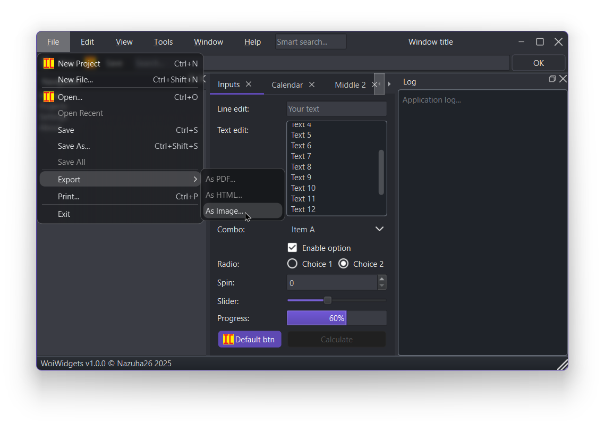
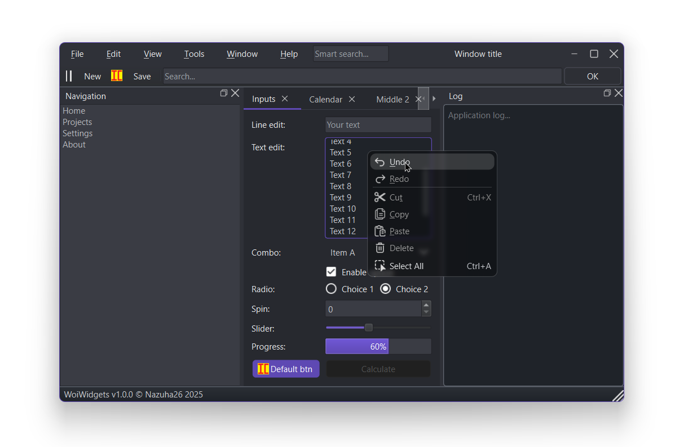
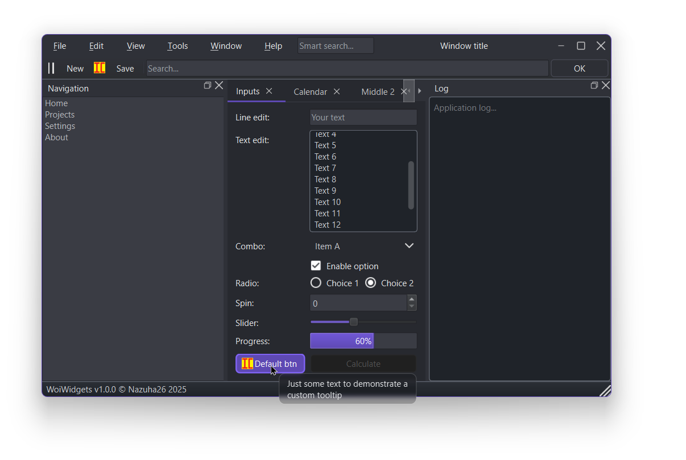

# WoiWidgets Qt C++


---


## About project

This repository provides a Windows window template with a **custom title bar** that preserves **native functions** such as resize, minimize, maximize, and close.

In addition, it implements a basic system of a **custom proxy style**, including support for blur in menus and popup widgets. This solution serves as a convenient foundation for developers who want to build a modern and visually appealing interface based on Qt.

### Preview
<p align="center">
  
  
</p>

---

## Quick Start

```cpp
#include <QtWidgets>

#include "CustomWindow.h"
#include "core/style/WoiStyle.h"
#include "core/WoiThemeEngine.h"

int main(int argc, char* argv[])
{
    QApplication a(argc, argv);

    QApplication::setStyle(new WoiStyle("Fusion"));

    WoiThemeEngine::applyDarkTheme();

    CustomWindow window(new QMainWindow());
    window.resize(800, 480);
    window.setWindowTitle("Window");

    window.show();
    return QApplication::exec();
}
```

> A more detailed example, where the **function of adding widgets to the window title bar** is implemented, can be found in [main.cpp](main.cpp).

---

## Demo

[](demo/demo.mp4)
